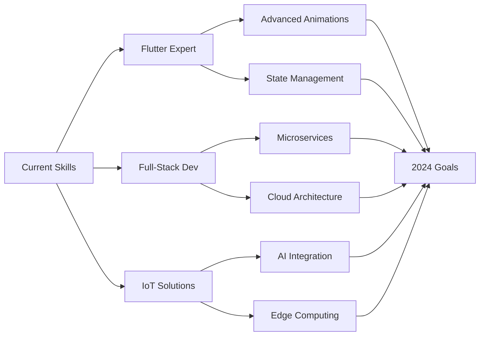

# Hi there 👋, I'm Rajanith Bandara

<div align="center">
  
</div>

<div align="center">
  
  
  
</div>

---

## 🚀 About Me

```javascript
const rajanith = {
    location: "Ratnapura, Sri Lanka 🇱🇰",
    education: "Final Year Computer Science @ University",
    currentFocus: ["Full-Stack Development", "Mobile Apps", "IoT Solutions"],
    technologies: {
        mobile: ["Flutter", "Dart"],
        frontend: ["React", "Next.js", "TypeScript", "Tailwind CSS"],
        backend: ["ASP.NET Core", "Node.js", "Express", "C#"],
        databases: ["Firebase", "MongoDB", "PostgreSQL"],
        cloud: ["Firebase", "Vercel", "Netlify"],
        tools: ["Git", "VS Code", "Postman", "Figma"]
    },
    currentlyLearning: ["Advanced Flutter Animations", "Microservices Architecture"],
    hobbies: ["Problem Solving", "Open Source", "Tech Blogging"],
    motto: "Code is not just a profession, it's an adventure! 🌟"
};
```

---

## 🔭 Featured Projects

<div align="center">

| Project | Description | Tech Stack | Status |
|---------|-------------|------------|--------|
| 🎓 **[EduTrack](https://github.com/rajanithbandara/edutrack)** | Academic progress tracker with GPA visualization & smart notifications | Flutter • Firebase • Material Design | 🚀 Active |
| 🏠 **[UniNest](https://github.com/rajanithbandara/uninest)** | Boarding house finder platform for university students | React • Firebase • Node.js • Maps API | 🛠️ Development |
| 🌫️ **[AirSense Dashboard](https://github.com/rajanithbandara/airsense)** | Real-time air quality monitoring with alert systems | ASP.NET Core • React • IoT Sensors | 📊 Beta |
| 🤖 **IoT Sensor Hub** | Multi-sensor board programming (Ultrasonic, Temperature, Humidity) | Arduino • C++ • MQTT | 🔧 Prototype |

</div>

---

## 🛠️ Technology Arsenal

<div align="center">

### Languages


### Frameworks & Libraries


### Databases & Cloud


### Tools & Platforms


</div>

---

## 📊 GitHub Analytics

<div align="center">
  
  
</div>

<div align="center">
  
  
</div>

---

## 📈 Contribution Activity

<div align="center">
  
### 🔥 Contribution Graph


### 📅 Contribution Calendar


</div>

---

## 🏆 Achievements & Trophies

<div align="center">
  
</div>

---

## 📈 Detailed Statistics

<details>
<summary>📊 More GitHub Stats</summary>
<br>

<div align="center">
  
**Contribution Summary**
  


</div>

</details>

---

## 🎯 Current Goals & Learning Path

<div align="center">



</div>

**🎯 2024 Objectives:**
- 🚀 Launch 3 production-ready applications
- 📱 Master advanced Flutter animations and custom widgets
- ☁️ Deploy scalable microservices architecture
- 🤝 Contribute to 10+ open source projects
- 📝 Write technical blogs and tutorials
- 🎓 Complete final year with distinction

---

## 📫 Let's Connect & Collaborate

<div align="center">

**I'm always excited to collaborate on innovative projects and discuss new technologies!**

[](mailto:rajanithbandaras@gmail.com)
[](https://www.linkedin.com/in/rajanith-bandara-373920264/)
[](https://rajaniths.online)
[](https://github.com/rajanithbandara)

</div>

---

<div align="center">
  
**"Innovation distinguishes between a leader and a follower." - Steve Jobs**

*Building tomorrow's solutions with today's code* 🚀

**Thanks for visiting! Don't forget to ⭐ star repositories you find interesting!**

</div>

---

<div align="center">
  
</div>
